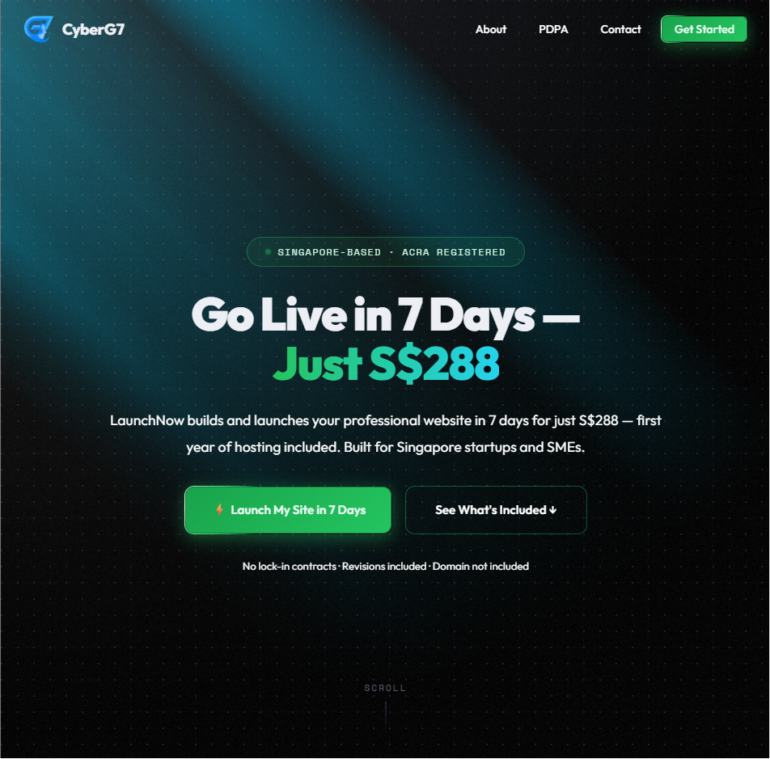
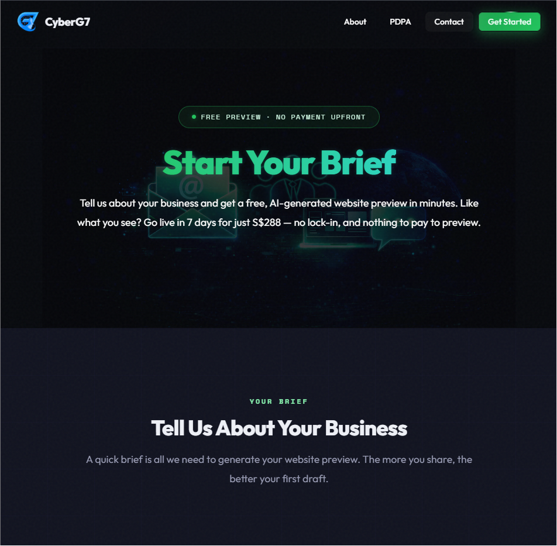
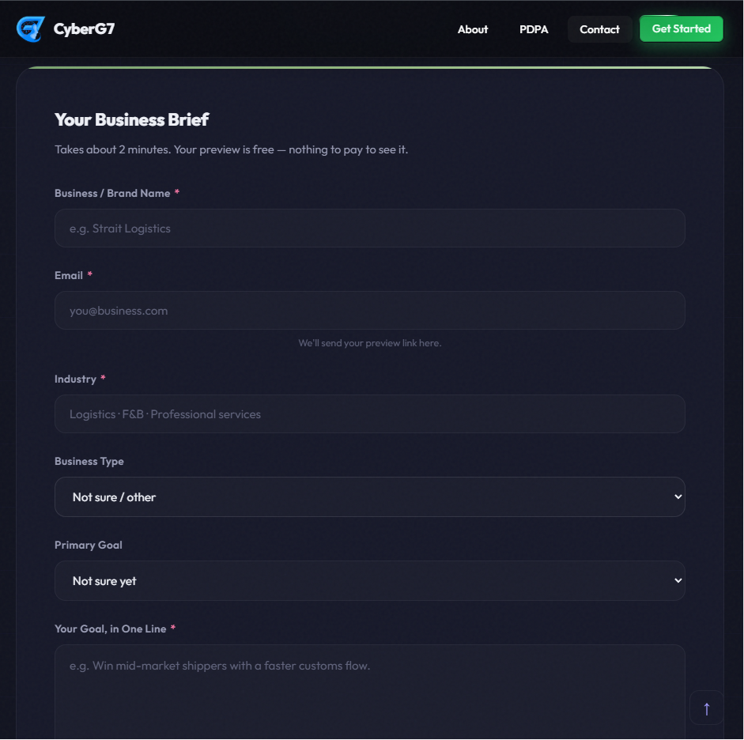

# 🚀 LaunchNow — 7-Day Website Intake Funnel

**🔗 Live site:** https://launchnow.cyberg7.com.sg

> **The static, conversion-first front-end for LaunchNow** — CyberG7's "professional website,
> live in 7 days for S$288" service for Singapore startups and SMEs. Marketing pages plus a
> native `/intake` brief form and a `/status` progress page that hand off to a separate
> AI-powered build engine.
> Production at **[launchnow.cyberg7.com.sg](https://launchnow.cyberg7.com.sg)**.


---

## TL;DR

**The problem.** A Singapore SME wants a credible website *fast* and *cheap*, without a DIY builder or
a months-long agency engagement. The hard part of selling that isn't the build — it's a landing
experience that earns trust (ACRA-registered, SME-Centre-supported), captures a structured brief, and
then *shows the work happening* instead of dropping the lead into a silent inbox.

**The solution.** A zero-framework static site you can read top-to-bottom: marketing + SEO pages, a
native `/intake` brief form, and a live `/status` page. The form POSTs the brief straight to a shared
backend (`agency.cyberg7.com.sg/api/intake`) over CORS, gets back an opaque job ID, then polls
`/api/status/<jobId>` and walks the visitor through a 7-stage build until their preview site is live —
no page reload, no framework, no build step.

**Why it's interesting.** This repo is deliberately the *thin, safe front counter* of a two-system
architecture. All the risk lives at the boundary: an open-redirect allow-list on any returned
checkout URL, a disciplined polling policy (backoff + jitter, hidden-tab pause, `Retry-After`, hard
timeout), a required PDPA-consent gate before submit, and a hard rule that the status page renders only
display-safe fields. The plan that produced it was put through a cross-model adversarial review and
locked only after it went `REVISE → APPROVED`.

| | DIY builder | Traditional agency | **LaunchNow funnel** |
|---|---|---|---|
| Time to credible site | DIY hours/weeks | Weeks–months | **7 days** |
| Upfront cost | Subscription | High | **S$288, year-1 hosting incl.** |
| Brief → progress UX | None | Email back-and-forth | **Native form → live `/status`** |
| Front-end weight | SaaS app | Heavy CMS | **Static HTML, no build** |

---

## What it does

A flat set of static pages served by Vercel. Two of them are the funnel; the rest sell and support it.

| Page (clean URL) | File | Role |
|---|---|---|
| `/` | `index.html` | Home / primary marketing page (the largest, richest page) |
| `/intake` | `intake.html` | **Brief form** — submits to the build engine, redirects to `/status` |
| `/status` | `status.html` | **Progress page** — polls the engine, advances to the preview when ready |
| `/about` | `about.html` | Company / trust story (ACRA-registered, SME-Centre-supported) |
| `/contact` | `contact.html` | Contact form (the pattern the intake form is modelled on) |
| `/web-design-singapore` | `web-design-singapore.html` | SEO landing page |
| `/affordable-web-design-singapore` | `affordable-web-design-singapore.html` | SEO landing page |
| `/website-in-7-days-singapore` | `website-in-7-days-singapore.html` | SEO landing page |
| `/ai-whatsapp-chatbot-singapore` | `ai-whatsapp-chatbot-singapore.html` | SEO landing page (adjacent offering) |
| `/order-confirmation`, `/thank-you` | `*.html` | Post-conversion confirmation pages |
| `/pdpa`, `/privacy`, `/terms` | `*.html` | Legal / PDPA policy pages |

Plus AEO/SEO surface: `sitemap.xml`, `robots.txt` (with an explicit AI-crawler allow-list — GPTBot,
ClaudeBot, PerplexityBot, Google-Extended, Applebot-Extended, etc.) and an `llms.txt` that states the
offer, services, trust signals, and an explicit *"what LaunchNow is NOT"* section for AI engines.

---

## How it works (the funnel hand-off)

This repo is the **front counter**. A separate Next.js app (`website-factory` / `cyberg7-agency`,
served at `agency.cyberg7.com.sg`) is the **kitchen**. They talk over HTTPS+CORS; Airtable is the shared
job log; an n8n workflow runs the build.

```
 Visitor ─► /intake (this repo) ──POST brief (JSON, CORS)──► agency.cyberg7.com.sg/api/intake
   │             │                                                  │
   │             │   honeypot + PDPA consent + field validation     ├─► write job row → Airtable (status: pending)
   │             │                                                  ├─► trigger n8n build  ├─► confirmation + operator email (Resend)
   │             │                                                  └─► return { jobId }  (UUIDv4, opaque)
   │             ▼
   │        redirect to /status?job=<jobId>
   │             │
   │             └──poll GET /api/status/<jobId> (CORS)──► { jobId, startedAt, snapshot, previewUrl?, failureReason? }
   │                  (backoff + jitter, pause on hidden tab, honor Retry-After, ~10-min hard cap)
   │                                                              ▲
   │                          n8n runs 7 stages, updating Airtable each step ──┘
   ▼
 when snapshot.currentStage === 'ready'  ─►  redirect to  <slug>-preview.cyberg7.com.sg
                                            (deposit/checkout is post-preview — not in this repo)
```

**Build stages reflected on `/status`** (run by the engine's n8n "Factory Orchestrator", not by this
repo): `pending → researching → designing → generating_assets → building → testing → deploying → ready`
(or `failed`). Between the mechanical stages the engine runs Claude Sonnet agents (research, design,
copy, component selection, asset queries) — that orchestration lives in `website-factory`, documented
here only as the contract this front-end consumes.

> The full cross-system map (the two Vercel projects, the Airtable schema, the n8n orchestrator and its
> AI agents) is captured in **`ARCHITECTURE.md`** at the repo root.

---

## Tech stack

- **Plain HTML + hand-rolled CSS + vanilla JavaScript** — no framework, no bundler, **no build step**
- **CSS design system** via custom properties — dark `#0a0b10` base, purple `#6c5ce7` accent
- **Google Fonts** — Outfit (display/body) + Space Mono (mono accents)
- **`intl-tel-input`** on the contact form; off-screen **honeypot** anti-spam on both forms
- **`fetch` + CORS** to the external build engine (`/api/intake`, `/api/status/<jobId>`) — no proxy layer
- **Google tag (gtag.js)** — Google Ads `AW-18194187704`, with a lead event fired on submit
- **JSON-LD** structured data + per-page `canonical`/Open Graph tags; `en_SG` locale
- **AEO** — `llms.txt`, `robots.txt` AI-crawler allow-list, `sitemap.xml`
- **Vercel** hosting — `cleanUrls`, `trailingSlash: false`, and a `/landing → /` permanent redirect (`vercel.json`)

> The build engine it talks to (Next.js · React · TypeScript · Tailwind · Zod · Airtable · n8n ·
> Anthropic Claude · Stripe · Resend · Clerk) lives in a **separate repo** and is out of scope here.

---

## Project structure

Flat by design — every page is a top-level file (clean URLs via Vercel).

```
launchnow/                                  # repo root (static site)
├── index.html                              # ⭐ home / main marketing page
├── intake.html                             # ⭐ /intake — brief form → build engine → /status
├── status.html                             # ⭐ /status — polls engine, advances to preview
├── about.html · contact.html               # company story · contact form (intake's pattern)
├── web-design-singapore.html               # ┐
├── affordable-web-design-singapore.html    # │ SEO landing pages
├── website-in-7-days-singapore.html        # │
├── ai-whatsapp-chatbot-singapore.html      # ┘
├── order-confirmation.html · thank-you.html# post-conversion pages
├── pdpa.html · privacy.html · terms.html   # legal / PDPA policy pages
├── sitemap.xml · robots.txt · llms.txt     # SEO + AEO surface (AI-crawler allow-list)
├── favicon.png · og-image.png              # brand assets
├── vercel.json                             # cleanUrls, redirects, no-trailing-slash
├── ARCHITECTURE.md                         # ⭐ full two-system map (funnel ↔ engine ↔ Airtable ↔ n8n)
├── PLAN.md · PLAN-REVIEW-LOG.md            # locked build plan + cross-model (Codex) review log
└── handoff.md                             # CORS hotfix handoff to the backend repo
```

---

## Getting started

There is no build step or dependency install — the site is static files. Serve the repo root with any
static server:

```bash
# any static file server works; e.g. Python:
python -m http.server 8000        # then open http://localhost:8000

# or the Vercel CLI to mirror production routing (cleanUrls / redirects):
vercel dev
```

**Deploy** is via Vercel against `main` (project `launchnow`, domain `launchnow.cyberg7.com.sg`).
Routing behaviour comes entirely from `vercel.json`:

```jsonc
{
  "cleanUrls": true,            // /intake instead of /intake.html
  "trailingSlash": false,
  "redirects": [{ "source": "/landing", "destination": "/", "permanent": true }]
}
```

> **Live-funnel dependency.** `/intake` and `/status` only work end-to-end while the build engine at
> `agency.cyberg7.com.sg` allows this origin via CORS and is up. A front-end flag (`BACKEND_READY`,
> currently `true`) gates the live wiring; the form/status pages were built shell-first and flipped on
> once the backend contract was pinned.

---

## Engineering highlights

- **Thin, safe boundary by design.** The whole repo is a deliberate front counter for a two-system
  architecture — payment, generation, and the preview site all live in the backend. The risky surface
  is just the CORS hand-off, and it's treated as such.
- **Defensive submit + status handling.** Open-redirect allow-list on any returned checkout URL
  (scheme + host must match), an opaque (UUIDv4) job token, and a status page that renders only
  display-safe fields — never raw brief data, PII, or internal URLs.
- **A disciplined polling policy, in vanilla JS.** Exponential backoff with jitter, pause while the tab
  is hidden, honor `Retry-After`, and a hard ~10-minute cap with a support fallback — written without a
  framework or state library.
- **Plan-as-contract, adversarially reviewed.** `PLAN.md` was locked only after a cross-model review
  (`PLAN-REVIEW-LOG.md`): a Codex pass returned `REVISE` with 10 findings, 9 were folded in (Gate-0
  backend-contract requirement, abuse mitigation moved to backend quotas, opaque tokens, PDPA consent,
  exact-href CTA inventory), and round 2 returned `APPROVED`.
- **AEO-native.** Not just `robots.txt` + `sitemap.xml` — a hand-written `llms.txt` (offer, services,
  trust signals, and an explicit "what it is NOT" to keep AI engines from mislabelling it as a security
  consultancy) and an explicit AI-crawler allow-list.

---

## Status & limitations

- **Live in production** at [launchnow.cyberg7.com.sg](https://launchnow.cyberg7.com.sg) (`/`, `/intake`,
  `/status` all serve 200); the front-end's `BACKEND_READY` flag is `true`.
- **Renamed / re-domained.** This is the funnel previously known as `intake-launchnow` (Vercel project
  + repo renamed to `launchnow`, domain moved from `intake-launchnow.cyberg7.com.sg`). Some internal docs
  still use the old `intake-launchnow` name — treat the live `launchnow.cyberg7.com.sg` host and the
  served HTML as the source of truth.
- **`handoff.md` is a resolved hotfix note.** It documents a (now-addressed) CORS break where the
  backend's allow-list still only permitted the old origin after the re-domain. It's retained as history;
  the live funnel submits end-to-end.
- **Canonical-host consistency was a tracked decision** (`PLAN.md` step 7): the home page's canonical/OG
  now point at `launchnow.cyberg7.com.sg`, but the plan flagged that some non-funnel pages historically
  carried `cyberg7.com` or malformed canonicals — verify per-page if doing SEO work.
- **Owner-gated open items** (from the plan): whether to add a bot challenge (Cloudflare Turnstile /
  hCaptcha) on `/intake`, whether to add a Meta Pixel (verified absent — would be a *new* tracker needing
  PDPA disclosure), and the Google Ads conversion *label*.
- **Out of scope for this repo:** Stripe checkout / pay-to-publish, the generated preview site at
  `<slug>-preview.cyberg7.com.sg`, and all backend logic (CORS, status API, n8n, the Claude build agents)
  — those live in `website-factory`. This is *not* the "LaunchNow" content sub-engine found in the
  sibling `video-generations` repo; same brand name, different thing.

---

## Ownership

Internal **CyberG7** project — built and maintained by [@Cyberg7tech](https://github.com/Cyberg7tech).
All rights reserved. Not open for external contributions; issues and questions welcome.


## 📸 Screenshots







